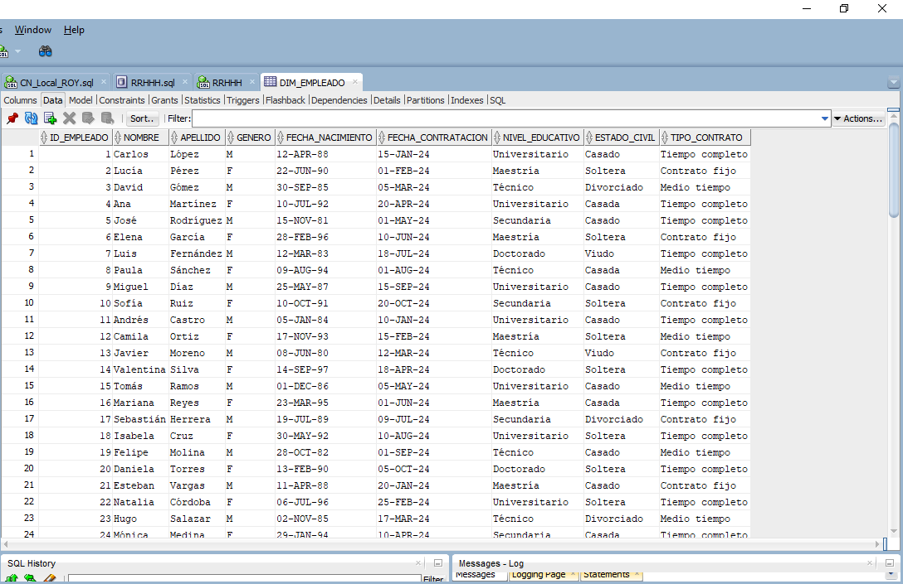
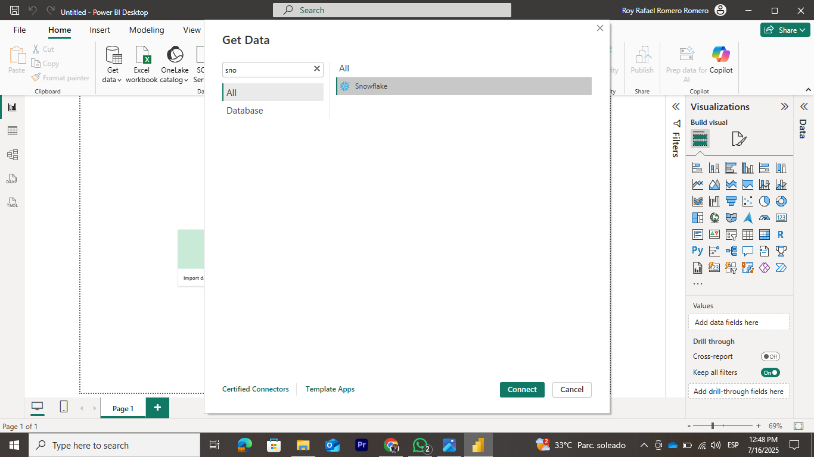
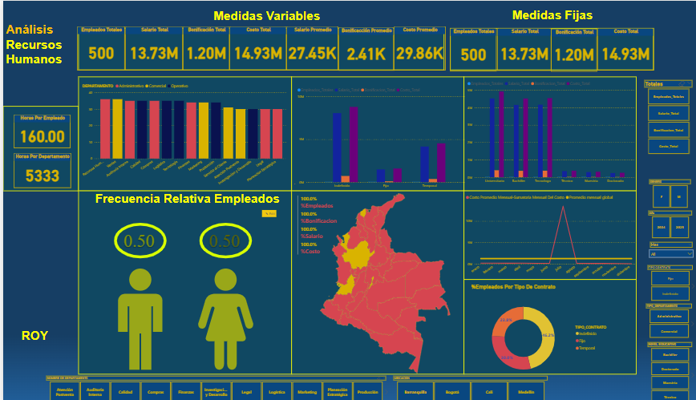

# 🚀 Oracle → Python → Snowflake → Power BI Pipeline  

Este proyecto implementa un **pipeline de datos** que conecta una base de datos **Oracle SQL** como fuente de datos, la procesa con **Python (pandas, oracledb)**, la almacena en **Snowflake** y finalmente crea un **dashboard interactivo en Power BI** para analizar información de Recursos Humanos.  

---

## 🎯 Preguntas Clave de Negocio  

El objetivo principal del proyecto es responder las siguientes **4 preguntas estratégicas de Recursos Humanos**:  

1. **¿En qué mes se presentan los mayores costos laborales?**  
   → El mes con mayor gasto es **julio**, lo que señala un pico de costos que debe analizarse.  

2. **¿Existe equidad en la contratación por género?**  
   → Sí, hay una **distribución equitativa (50% hombres y 50% mujeres)**, lo que refleja inclusión en el proceso de contratación.  

3. **¿Qué áreas concentran mayor número de empleados y cuál es su impacto en los salarios?**  
   → **Recursos Humanos y Ventas** tienen **36 empleados cada una**, representando el **7.1% y 7.2% del salario total**, respectivamente.  

4. **¿Cuál es la relación entre el número de empleados y las horas promedio trabajadas?**  
   → En promedio, **Recursos Humanos registra 160.42 horas mensuales por empleado**, mientras que **Ventas 156.11 horas mensuales por empleado**, lo que permite comparar cargas laborales entre áreas.  

---

## 📌 Arquitectura del Pipeline  

1. **Fuente de Datos - Oracle SQL**  
   - Tablas: `Departamentos`, `Empleados`, `Hechos`.  
   - Los datos se consultan y exportan desde Oracle.  

   📷 *Ejemplo tabla Oracle:*  
     

---

2. **Transformación - Python**  
   - Se emplea `pandas` para limpiar y transformar los datos.  
   - Se usa `oracledb` para conectarse a Oracle y extraer la información.  

   📂 Archivos principales:  
   - `Python/FromOracleTopython.ipynb` → Extracción y transformación de datos.  
   - `Python/OraEmpleados.csv`, `Python/OraDepartamentos.csv`, `Python/OraHechos.csv`.  

---

3. **Carga - Snowflake**  
   - Los datos procesados en CSV se cargan a **Snowflake**.  
   - Se crean **stages y tablas** para gestionar los datos.  

   📷 *Ejemplo creación de tabla:*  
     

   📂 Archivos:  
   - `Snowflake/SnowSQL/Creando-Stage.png`  
   - `Snowflake/SnowSQL/Copiando-chequeando-csv1.png`  
   - `Snowflake/SnowSQL/Usando-Warehouse.png`  

---

4. **Visualización - Power BI**  
   - Conexión directa de Power BI a Snowflake.  
   - Creación de dashboard con métricas claves de Recursos Humanos.  

   📷 *Conexión Power BI - Snowflake:*  
     

   📷 *Dashboard:*  
     

---

## 📊 Insights Clave  

- Identificación de **meses con mayores costos** para gestionar presupuestos.  
- Confirmación de **equidad de género** en la fuerza laboral.  
- Detección de **departamentos con mayor personal** y su impacto en los salarios.  
- Análisis de **cargas laborales promedio** para prevenir sobrecarga o subutilización.  

---

## ⚙️ Tecnologías Usadas  

- **Oracle Database 21c** → Fuente de datos.  
- **Python** → Extracción y transformación (`pandas`, `oracledb`).  
- **Snowflake** → Almacenamiento y procesamiento en la nube.  
- **Power BI** → Visualización e insights.  

---

## 📁 Estructura del Repositorio  

